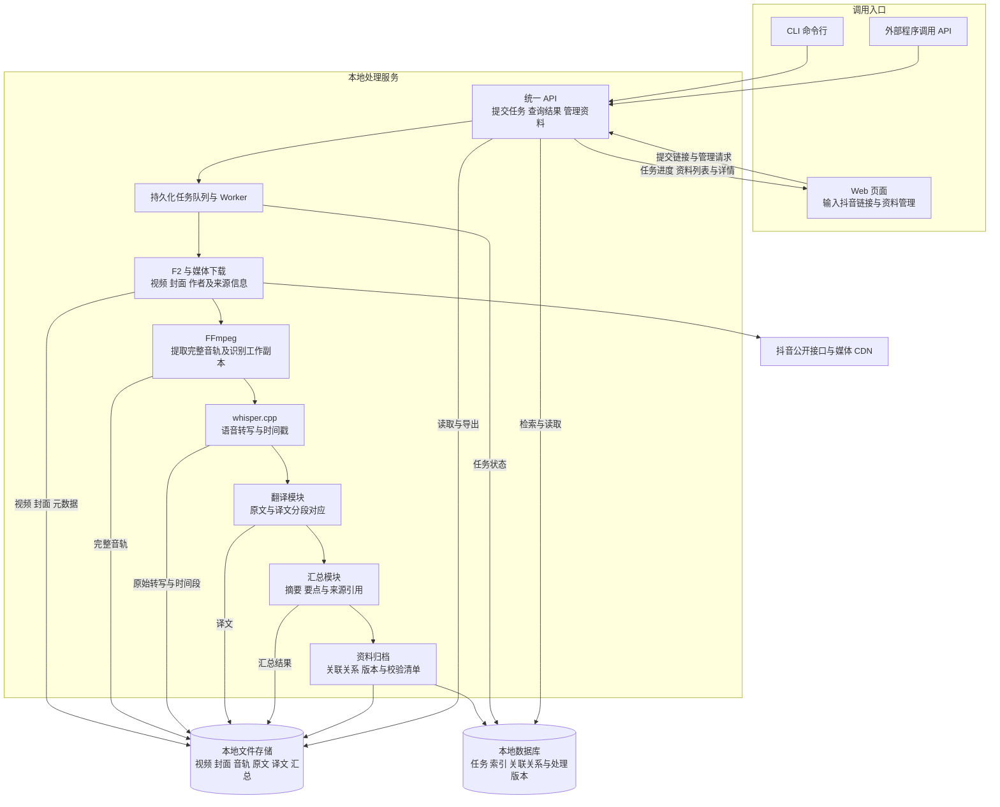

# Douyin2Text 项目架构与使用说明

Douyin2Text 的目标是提供一个本地视频资料管理系统。用户可通过 CLI、API 或 Web 页面提交抖音链接，系统获取视频、封面及来源信息，提取音轨并转写为文字，再完成翻译和汇总，将所有资料存储在本地，通过 Web 界面查看、管理和导出。

下方架构描述目标产品。当前仓库已有 CLI、API 网关、任务队列、下载、音轨提取、转写与结果保存的代码；Web 管理、完整翻译模块和汇总模块尚待实现。现有服务端仍是草稿，需要仓库外的配置、凭据、模型与工具才能运行。本文不代表本次已验证实际部署状态。

## 目标架构



三个入口共用同一套 API 和处理流水线。Web 页面既能提交新链接，也能管理 CLI 或 API 创建的资料；提交入口不会影响资料的归档位置与关联关系。

文件存储保存完整媒体和文字，数据库保存任务状态、资料索引及关联关系。现有网关和队列采用 FastAPI 与 SQLite，可作为目标架构的基础。下载和识别在本地服务主机执行，部署可以沿用 Mac mini；“本地存储”指服务主机的磁盘，客户端按需导出。

## 目标处理流程

1. **提交链接**：通过 CLI、API 或 Web 输入抖音链接，创建任务，显示或返回任务 ID。
2. **获取源资料**：解析视频 ID，获取作者、描述、发布时间等元数据，下载视频与平台封面。
3. **分离音轨**：从完整视频提取完整音轨，保留视频和音频；另外生成适合语音识别的工作副本。
4. **转写文字**：使用 whisper.cpp 获取原始文字与时间段，将每段文字关联到对应的视频和音轨时间范围。
5. **翻译文字**：基于原始转写生成目标语言译文，保留原文和译文的分段对应关系。同语种资料可跳过翻译，并记录跳过原因。
6. **生成汇总**：结合来源信息、原文或译文生成摘要与要点，保留能够定位到原文时间段的引用。完整文字和汇总分别保存。
7. **本地归档**：用统一资料 ID 关联视频、封面、音轨、原文、译文及汇总，保存文件校验信息与处理版本。各阶段产物及时保存，后续失败仍可查看已有资料。
8. **Web 管理与导出**：在资料列表查看封面和处理进度，在详情页播放视频或音频、查看对应文字、译文及汇总，按需下载和导出。

音轨先进行语音转写，再对文字翻译；目标流程输出原始音轨、原文和译文，不包含翻译配音。翻译与汇总引擎尚未选定，需作为独立模块接入，避免把两项能力误归给 whisper.cpp。

## Web 界面与资料对应

以下为待实现的产品要求：

| 页面 | 主要功能 |
| --- | --- |
| 链接提交 | 输入抖音链接，选择目标语言和是否生成汇总，提交并查看任务进度 |
| 资料列表 | 展示封面、标题、作者、处理状态，按关键词及状态查找资料 |
| 资料详情 | 同一页展示视频、音频、来源信息、原始文字、译文和汇总 |
| 时间段查看 | 点击原文或译文跳转到对应播放时间；汇总引用可定位到原文片段 |
| 资料管理 | 编辑标题及标签、重试失败阶段、重新生成译文或汇总、下载或导出资料 |

目标数据关系如下，属于设计要求，尚未完整落入当前数据库：

| 对象 | 对应关系 |
| --- | --- |
| 来源资料 | 统一 `asset_id` 关联平台视频 ID、原链接、标题、作者与发布时间 |
| 媒体文件 | 视频、封面和完整音轨归属同一个 `asset_id`，记录文件路径、类型与 SHA-256 |
| 原文片段 | 每段拥有 `segment_id`、起止时间和文字，时间范围对应同一资料的视频及音轨 |
| 翻译结果 | 保存源片段 ID、目标语言、译文及处理版本，允许一段或多段原文对应一段译文 |
| 汇总结果 | 保存摘要、要点及引用的原文片段 ID，能够追溯到媒体时间范围 |
| 处理任务 | 关联资料 ID、各阶段状态及产物版本，重新处理不覆盖原始媒体和已有版本 |

## 当前实现与目标差距

| 能力 | 当前仓库状态 | 需要补充 |
| --- | --- | --- |
| CLI 和 API 提交 | 已有客户端和服务端草稿 | 补齐部署配置与真实运行验收 |
| 视频 封面与元数据获取 | 已有 F2 接入和下载代码 | 在目标环境验证平台接口 |
| 音轨提取与文字转写 | 已有 FFmpeg 和 whisper.cpp 接入代码 | 准备工具、模型及启动配置 |
| 本地文件保存 | 已有媒体目录、校验清单和版本快照 | 增加统一资料索引与片段对应关系 |
| 翻译 | 有英文转中文条件分支，依赖的脚本未收录 | 完整翻译模块、目标语言参数与分段关联 |
| 汇总 | 尚未实现 | 汇总模块、引用关联、版本与查询接口 |
| Web 提交与管理 | 尚未实现 | 页面、资料列表与详情 API、管理操作及播放文字联动 |

## 使用的两个核心 GitHub 仓库

| 上游项目 | 在 Douyin2Text 中的用途 | 接入位置 |
| --- | --- | --- |
| [Johnserf-Seed/f2](https://github.com/Johnserf-Seed/f2) | 获取抖音访客凭据、请求视频详情，取得作者、描述、发布时间、视频候选地址和封面地址 | `backend/src/douyin2text/providers/f2.py` 通过 `SourceProvider` 接入 |
| [ggml-org/whisper.cpp](https://github.com/ggml-org/whisper.cpp) | 在 Mac mini 上运行 Whisper 模型，将音轨转为含时间段的文字；交接方案使用 Apple Metal | `backend/src/douyin2text/providers/whisper_cpp.py` 通过 `TranscriptionProvider` 接入 |

F2 提供多平台下载和接口数据处理能力，本项目仅使用其中的抖音能力。whisper.cpp 是 Whisper 的 C/C++ 实现，支持 Apple Silicon 与 Metal。能力说明分别见 [F2 官方仓库](https://github.com/Johnserf-Seed/f2) 和 [whisper.cpp 官方仓库](https://github.com/ggml-org/whisper.cpp)。

本项目没有把两个上游仓库源码复制进当前仓库，也没有配置 Git 子模块。F2 和 whisper.cpp 分别封装为可替换的视频来源与转写适配器，流水线通过统一接口调用。F2 作为可选 Python 依赖接入，whisper.cpp 作为单独运行的本机服务接入。实际媒体文件由项目自己的 HTTP 下载代码保存。

交接材料记录了以下参考提交，可用于复现当时的接入版本；它们不是当前仓库已锁定的依赖，也不表示已核实服务器正在运行这些版本。

| 项目 | 交接材料中的参考提交 |
| --- | --- |
| F2 | `3f842b6b28bf70e5525631f7d992245b2dbccc0b`，标注为 `v0.0.1.8-pw3` |
| whisper.cpp | `60c0be6ac8fa71b1a2ae2dd938a31a34a508e774` |

FFmpeg、FastAPI、SQLite 和 Node.js 也是运行链路的组成部分；“两个仓库”指下载和识别这两项核心能力的上游来源。

## 模块封装与配置切换

视频来源采用 `SourceProvider`，转写采用 `TranscriptionProvider`。F2 与 whisper.cpp 的库调用和响应解析仅存在于具体适配器中。新增其他库的适配器后，通过服务配置切换，CLI 与 API 无需改动；提供方变化会更新缓存指纹。

安装、新入口、迁移方式和替代适配器约定见 [模块封装说明](docs/providers.md)。

## 当前代码处理流程

1. 客户端检查链接，向网关提交 `url` 和固定 v1 参数，并携带 `Idempotency-Key`。
2. 网关检查 Bearer 令牌与请求格式，将任务持久化到 SQLite。相同幂等键与相同请求返回已有任务，相同键对应不同请求返回冲突。
3. Worker 解析平台视频 ID，通过 F2 获取公开元数据。公开访客无法获取详情时，任务进入 `waiting_login`。
4. 在短边不超过 1080 的候选视频中选择最高短边、再按码率选优，并下载完整视频及平台封面。网络模块检查目标域名和实际连接地址。
5. FFmpeg 从完整视频直接封装完整音轨，再生成 16 kHz 单声道 PCM WAV 工作副本。ffprobe 和完整解码检查用于验证媒体及音视频时长。
6. Worker 向本机 whisper-server 发送 WAV，使用自动语种识别，保存原始 JSON、文字和时间段。代码还检查转写末尾覆盖情况。
7. 生成含来源、媒体引用和带时间戳原始转写的 Markdown，通过快照模块保存版本结果及 SHA-256。有效缓存和转写检查点可减少重复处理。
8. 客户端轮询任务，成功后获取 manifest 和 Markdown，检查格式、来源、模型信息及 Markdown 哈希，再保存到调用电脑。

当前代码输出完整机器转写，尚未实现目标架构中的汇总模块，也没有说话人分离。英文转写可进入本地翻译分支，但对应 `translate_mlx.py` 和 `.llm-venv` 未收录在仓库。未提供中文译文且未允许原语种交付时，服务端会等待确认；客户端对非中文结果仍要求完整中文翻译元数据。

## 代码目录与职责

| 路径 | 职责 |
| --- | --- |
| `integration-bundle/src/media-service-client.js` | 客户端请求、轮询、结果校验、Range 探测、短期播放链接和文件保存 |
| `integration-bundle/scripts/media-service.mjs` | CLI 入口，从私有令牌文件读取认证信息 |
| `integration-bundle/scripts/lan-acceptance.mjs` | 跨设备局域网验收脚本 |
| `integration-bundle/test/` | 客户端和翻译契约测试 |
| `backend/src/douyin2text/api.py` | FastAPI 路由、SQLite 队列、单 Worker、认证、幂等、媒体访问 |
| `backend/src/douyin2text/pipeline.py` | 编排来源适配器、媒体下载、FFmpeg 处理、转写适配器与归档 |
| `backend/src/douyin2text/providers/` | 提供方接口、F2 和 whisper.cpp 适配器、配置工厂与缓存指纹 |
| `backend/src/douyin2text/runtime.py` | 统一数据目录与配置加载 |
| `backend/pyproject.toml` | Python 包与运行依赖 |
| `backend/config.example.json` | 服务与提供方配置模板 |
| `backend/tests/test_pipeline.py` 与 `test_providers.py` | 可替换模块、缓存、流水线及 API 的隔离测试 |
| `backend/src/douyin2text/safe_network.py` | 平台 URL、重定向与公网连接地址校验 |
| `backend/src/douyin2text/markdown.py` | Markdown 生成和可选翻译分支 |
| `backend/src/douyin2text/artifacts.py` | 文件哈希、路径检查、版本快照与对外 manifest |
| `backend/tests/integration/test_gateway.py` | 服务端接口测试，依赖服务端配置和运行环境 |
| `handoff/2026-10-05/package/` | 当日交接快照；日常客户端入口使用 `integration-bundle/` |

## 当前对外接口

| 方法 | 路径 | 用途 |
| --- | --- | --- |
| GET | `/health` | 检查模型、Worker、剩余磁盘空间与队列 |
| POST | `/v1/jobs` | 提交任务，必须携带 `Idempotency-Key` |
| GET | `/v1/jobs/{job_id}` | 查询任务状态 |
| GET | `/v1/jobs/{job_id}/manifest` | 获取来源、模型、媒体引用和校验清单 |
| GET | `/v1/jobs/{job_id}/markdown` | 获取 Markdown |
| GET / HEAD | `/v1/media/{media_id}/{kind}` | 读取视频、音频或封面；提供 Range 访问 |
| POST | `/v1/media/{media_id}/playback` | 创建视频或音频短期播放链接 |
| GET / HEAD | `/play/{token}` | 使用短期链接播放，令牌有效期为 599 秒 |

除 `/play/{token}` 使用短期令牌外，上述接口都要求 Bearer 认证。客户端轮询的正常状态依次为 `queued`、`downloading`、`extracting`、`transcribing`、`succeeded`；异常终止或等待人工处理的状态包括 `failed`、`partial_failed`、`waiting_login`、`waiting_confirmation`。

上述接口对应当前 v1，实现目标架构还需新增资料列表、详情、标签编辑、阶段重试、翻译与汇总结果接口，并扩展任务参数和阶段状态。这些扩展尚未纳入当前契约。

完整字段、错误与验收要求见 [v1 接口契约](integration-bundle/docs/contracts/media-service-v1.md)。

## 数据与运行环境

服务端默认数据根目录为 `/Users/mac/Documents/Personal-Wiki-Media`，可用 `DOUYIN2TEXT_DATA_DIR` 调整；配置路径可用 `DOUYIN2TEXT_CONFIG` 调整。默认读取 `state/config.json` 和 `state/api-token`。任务数据库为 `state/v1.sqlite3`，模型放在 `models/`；视频、音轨、转写、元数据和工作副本分别使用 `video/`、`audio/`、`transcripts/`、`metadata/`、`tmp/`。

运行前需要准备以下环境：

- 客户端使用 Node.js 24 或更高版本，无新增第三方 Node 依赖。
- 服务端使用 Python 3.11 或更高版本，通过 `backend/pyproject.toml` 安装 FastAPI、Uvicorn、httpx、httpcore、Pydantic、psutil。F2 是可选提供方依赖；尚无完整生产依赖锁定文件。
- FFmpeg 与 ffprobe 当前使用 `/opt/homebrew/bin/` 下的路径。
- whisper.cpp 需要单独编译或安装、准备模型并启动本机 `127.0.0.1:8767` 服务。
- 数据目录、配置和私有令牌需要预先准备。交接方案采用 launchd 常驻，但仓库未收录完整启动配置。

网关端口在草稿中为 `8765`，监听地址由配置的 `bind` 决定。交接文档的局域网地址仅是环境线索，使用时应设置实际 `MEDIA_SERVICE_URL`。长期令牌、模型及原始媒体不应纳入源码仓库。

## 客户端使用示例

先在仓库根目录进入客户端目录，并设置服务地址及已准备好的私有令牌文件：

```sh
cd integration-bundle
export MEDIA_SERVICE_URL='http://YOUR_MAC_MINI_IP:8765'
export MEDIA_SERVICE_TOKEN_FILE='/absolute/private/media-service.token'
chmod 600 "$MEDIA_SERVICE_TOKEN_FILE"

node scripts/media-service.mjs health
node scripts/media-service.mjs submit 'https://v.douyin.com/YOUR_SHARE_ID/'
```

将返回的任务 ID 替换为下方 `JOB_ID`。输出目录必须存在，文件路径需使用实际路径：

```sh
mkdir -p /absolute/output
node scripts/media-service.mjs status JOB_ID
node scripts/media-service.mjs wait JOB_ID /absolute/output/transcript.md
```

成功后会保存 `transcript.md` 和 `transcript.md.manifest.json`。默认等待上限为 10 分钟，等待超时不会取消服务端任务，可以继续查询，成功后用 `fetch` 取回结果。已存在且内容不同的输出文件会被拒绝覆盖。

```sh
node scripts/media-service.mjs fetch JOB_ID /absolute/output/transcript.md
node scripts/media-service.mjs probe MEDIA_ID video
node scripts/media-service.mjs playback MEDIA_ID video
```

`MEDIA_ID` 取自 manifest 的 `media.video.path` 中 `/v1/media/` 后的那一段。客户端默认保存文字与清单；视频留在 Mac mini，通过稳定认证接口或短期链接读取。

## 验证与实施顺序

客户端契约测试可在 `integration-bundle/` 内运行 `npm test`。它使用本机测试接口验证客户端行为；实际下载、模型识别与跨设备通信还需按契约单独验收。

已提供 Python 包、配置模板及可替换提供方接口。完整部署仍需补齐依赖锁定、目录初始化、whisper-server 和网关常驻配置，以及翻译脚本。当前 v1 对超 30 分钟或超 1 GiB 的媒体要求人工确认，也没有提供独立的任务重试或取消接口。

目标架构建议分步落地：

1. 补齐可运行的 CLI 和 API 基础服务，验证下载、完整音轨提取、转写和本地保存。
2. 建立资料索引与片段关联，增加 Web 链接提交、资料列表、详情和播放查看。
3. 接入完整翻译模块，在详情页提供原文与译文对应查看。
4. 接入汇总模块，增加要点引用、版本查看、阶段重试和导出。

进一步部署与验收说明见 [Mac mini 服务端交接](integration-bundle/docs/contracts/mac-mini-server-handoff.md) 和 [局域网调用说明](integration-bundle/LAN-INSTRUCTIONS.md)。
