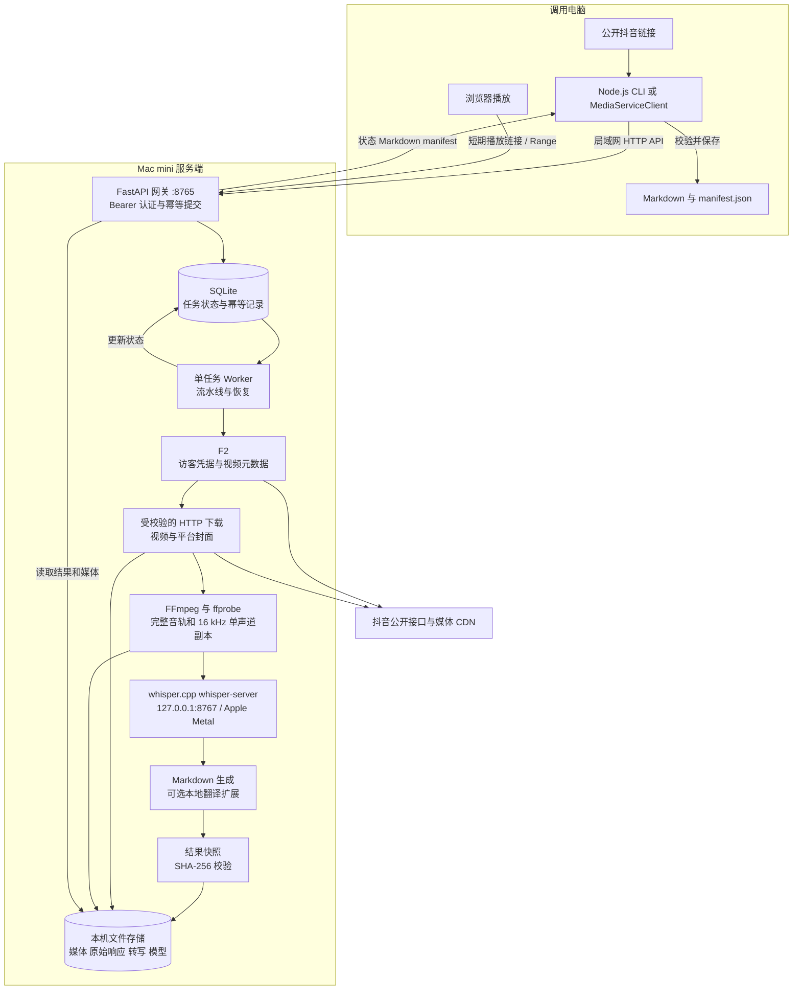

# Douyin2Text 项目架构与使用说明

Douyin2Text 将公开抖音视频链接转换为带时间戳的完整转写 Markdown，并保留视频、完整音轨、封面及来源信息。调用电脑通过局域网提交任务，Mac mini 执行下载和本地语音识别，客户端取回文字与结果清单，媒体文件继续保存在服务端。

本文依据当前仓库源码和接口契约编写。仓库包含 Node.js 客户端、Python 服务端草稿和交接材料；服务端运行还依赖仓库外的配置、凭据、模型与工具，因此克隆仓库后不能直接启动完整服务。本文不代表本次已验证实际部署状态。

## 项目架构



网关负责对外接口，whisper-server 只供本机调用。SQLite 保存任务与幂等记录，实际视频、音轨和转写结果保存在文件系统中。Worker 顺序处理任务，避免多个识别任务同时占用模型资源。

## 使用的两个核心 GitHub 仓库

| 上游项目 | 在 Douyin2Text 中的用途 | 接入位置 |
| --- | --- | --- |
| [Johnserf-Seed/f2](https://github.com/Johnserf-Seed/f2) | 获取抖音访客凭据、请求视频详情，取得作者、描述、发布时间、视频候选地址和封面地址 | `server-v1-draft/pipeline_v1.py` 导入 `TokenManager`、`ClientConfManager`、`DouyinCrawler` 和 `PostDetail` |
| [ggml-org/whisper.cpp](https://github.com/ggml-org/whisper.cpp) | 在 Mac mini 上运行 Whisper 模型，将音轨转为含时间段的文字；交接方案使用 Apple Metal | `server-v1-draft/pipeline_v1.py` 调用本机 `/health` 和 `/inference`，读取 `verbose_json` |

F2 提供多平台下载和接口数据处理能力，本项目仅使用其中的抖音能力。whisper.cpp 是 Whisper 的 C/C++ 实现，支持 Apple Silicon 与 Metal。能力说明分别见 [F2 官方仓库](https://github.com/Johnserf-Seed/f2) 和 [whisper.cpp 官方仓库](https://github.com/ggml-org/whisper.cpp)。

本项目没有把两个上游仓库源码复制进当前仓库，也没有配置 Git 子模块。F2 作为 Python 依赖接入，whisper.cpp 作为单独运行的本机服务接入。实际媒体文件由项目自己的 HTTP 下载代码保存。

交接材料记录了以下参考提交，可用于复现当时的接入版本；它们不是当前仓库已锁定的依赖，也不表示已核实服务器正在运行这些版本。

| 项目 | 交接材料中的参考提交 |
| --- | --- |
| F2 | `3f842b6b28bf70e5525631f7d992245b2dbccc0b`，标注为 `v0.0.1.8-pw3` |
| whisper.cpp | `60c0be6ac8fa71b1a2ae2dd938a31a34a508e774` |

FFmpeg、FastAPI、SQLite 和 Node.js 也是运行链路的组成部分；“两个仓库”指下载和识别这两项核心能力的上游来源。

## 一条链接如何变成文字

1. 客户端检查链接，向网关提交 `url` 和固定 v1 参数，并携带 `Idempotency-Key`。
2. 网关检查 Bearer 令牌与请求格式，将任务持久化到 SQLite。相同幂等键与相同请求返回已有任务，相同键对应不同请求返回冲突。
3. Worker 解析平台视频 ID，通过 F2 获取公开元数据。公开访客无法获取详情时，任务进入 `waiting_login`。
4. 在短边不超过 1080 的候选视频中选择最高短边、再按码率选优，并下载完整视频及平台封面。网络模块检查目标域名和实际连接地址。
5. FFmpeg 从完整视频直接封装完整音轨，再生成 16 kHz 单声道 PCM WAV 工作副本。ffprobe 和完整解码检查用于验证媒体及音视频时长。
6. Worker 向本机 whisper-server 发送 WAV，使用自动语种识别，保存原始 JSON、文字和时间段。代码还检查转写末尾覆盖情况。
7. 生成含来源、媒体引用和带时间戳原始转写的 Markdown，通过快照模块保存版本结果及 SHA-256。有效缓存和转写检查点可减少重复处理。
8. 客户端轮询任务，成功后获取 manifest 和 Markdown，检查格式、来源、模型信息及 Markdown 哈希，再保存到调用电脑。

当前输出是完整机器转写，代码没有实现摘要或说话人分离。英文转写可进入本地翻译分支，但对应 `translate_mlx.py` 和 `.llm-venv` 未收录在仓库。未提供中文译文且未允许原语种交付时，服务端会等待确认；客户端对非中文结果仍要求完整中文翻译元数据。

## 代码目录与职责

| 路径 | 职责 |
| --- | --- |
| `integration-bundle/src/media-service-client.js` | 客户端请求、轮询、结果校验、Range 探测、短期播放链接和文件保存 |
| `integration-bundle/scripts/media-service.mjs` | CLI 入口，从私有令牌文件读取认证信息 |
| `integration-bundle/scripts/lan-acceptance.mjs` | 跨设备局域网验收脚本 |
| `integration-bundle/test/` | 客户端和翻译契约测试 |
| `server-v1-draft/api_v1.py` | FastAPI 路由、SQLite 队列、单 Worker、认证、幂等、媒体访问 |
| `server-v1-draft/pipeline_v1.py` | F2 获取详情、媒体下载、FFmpeg 处理、whisper.cpp 调用 |
| `server-v1-draft/safe_network.py` | 平台 URL、重定向与公网连接地址校验 |
| `server-v1-draft/markdown_v1.py` | Markdown 生成和可选翻译分支 |
| `server-v1-draft/artifacts.py` | 文件哈希、路径检查、版本快照与对外 manifest |
| `server-v1-draft/test_api_v1.py` | 服务端接口测试，依赖服务端配置和运行环境 |
| `handoff/2026-10-05/package/` | 当日交接快照；日常客户端入口使用 `integration-bundle/` |

## 对外接口

| 方法 | 路径 | 用途 |
| --- | --- | --- |
| GET | `/health` | 检查模型、Worker、剩余磁盘空间与队列 |
| POST | `/v1/jobs` | 提交任务，必须携带 `Idempotency-Key` |
| GET | `/v1/jobs/{job_id}` | 查询任务状态 |
| GET | `/v1/jobs/{job_id}/manifest` | 获取来源、模型、媒体引用和校验清单 |
| GET | `/v1/jobs/{job_id}/markdown` | 获取 Markdown |
| GET / HEAD | `/v1/media/{media_id}/{kind}` | 读取视频、音频或封面；提供 Range 访问 |
| POST | `/v1/media/{media_id}/playback` | 创建视频或音频短期播放链接 |
| GET / HEAD | `/play/{token}` | 使用短期链接播放，令牌有效期为 599 秒 |

除 `/play/{token}` 使用短期令牌外，上述接口都要求 Bearer 认证。客户端轮询的正常状态依次为 `queued`、`downloading`、`extracting`、`transcribing`、`succeeded`；异常终止或等待人工处理的状态包括 `failed`、`partial_failed`、`waiting_login`、`waiting_confirmation`。

完整字段、错误与验收要求见 [v1 接口契约](integration-bundle/docs/contracts/media-service-v1.md)。

## 数据与运行环境

服务端草稿将数据根目录写为 `/Users/mac/Documents/Personal-Wiki-Media`，并读取 `state/config.json` 和 `state/api-token`。任务数据库为 `state/v1.sqlite3`，模型放在 `models/`；视频、音轨、转写、元数据和工作副本分别使用 `video/`、`audio/`、`transcripts/`、`metadata/`、`tmp/`。

运行前需要准备以下环境：

- 客户端使用 Node.js 24 或更高版本，无新增第三方 Node 依赖。
- 服务端需要 Python 环境及 F2、FastAPI、Uvicorn、httpx、httpcore、Pydantic、psutil 等依赖；仓库尚无完整依赖锁定文件。
- FFmpeg 与 ffprobe 当前使用 `/opt/homebrew/bin/` 下的路径。
- whisper.cpp 需要单独编译或安装、准备模型并启动本机 `127.0.0.1:8767` 服务。
- 数据目录、配置和私有令牌需要预先准备。交接方案采用 launchd 常驻，但仓库未收录完整启动配置。

网关端口在草稿中为 `8765`，监听地址由配置的 `bind` 决定。交接文档的局域网地址仅是环境线索，使用时应设置实际 `MEDIA_SERVICE_URL`。长期令牌、模型及原始媒体不应纳入源码仓库。

## 客户端使用示例

先在仓库根目录进入客户端目录，并设置服务地址及已准备好的私有令牌文件：

```sh
cd integration-bundle
export MEDIA_SERVICE_URL='http://YOUR_MAC_MINI_IP:8765'
export MEDIA_SERVICE_TOKEN_FILE='/absolute/private/media-service.token'
chmod 600 "$MEDIA_SERVICE_TOKEN_FILE"

node scripts/media-service.mjs health
node scripts/media-service.mjs submit 'https://v.douyin.com/YOUR_SHARE_ID/'
```

将返回的任务 ID 替换为下方 `JOB_ID`。输出目录必须存在，文件路径需使用实际路径：

```sh
mkdir -p /absolute/output
node scripts/media-service.mjs status JOB_ID
node scripts/media-service.mjs wait JOB_ID /absolute/output/transcript.md
```

成功后会保存 `transcript.md` 和 `transcript.md.manifest.json`。默认等待上限为 10 分钟，等待超时不会取消服务端任务，可以继续查询，成功后用 `fetch` 取回结果。已存在且内容不同的输出文件会被拒绝覆盖。

```sh
node scripts/media-service.mjs fetch JOB_ID /absolute/output/transcript.md
node scripts/media-service.mjs probe MEDIA_ID video
node scripts/media-service.mjs playback MEDIA_ID video
```

`MEDIA_ID` 取自 manifest 的 `media.video.path` 中 `/v1/media/` 后的那一段。客户端默认保存文字与清单；视频留在 Mac mini，通过稳定认证接口或短期链接读取。

## 验证与后续完善

客户端契约测试可在 `integration-bundle/` 内运行 `npm test`。它使用本机测试接口验证客户端行为；实际下载、模型识别与跨设备通信还需按契约单独验收。

要将当前草稿整理成可直接部署的版本，还需补齐依赖锁定、配置模板、目录初始化、whisper-server 和网关启动配置，以及可选翻译脚本。当前 v1 对超 30 分钟或超 1 GiB 的媒体要求人工确认，也没有提供独立的任务重试或取消接口。

进一步部署与验收说明见 [Mac mini 服务端交接](integration-bundle/docs/contracts/mac-mini-server-handoff.md) 和 [局域网调用说明](integration-bundle/LAN-INSTRUCTIONS.md)。
