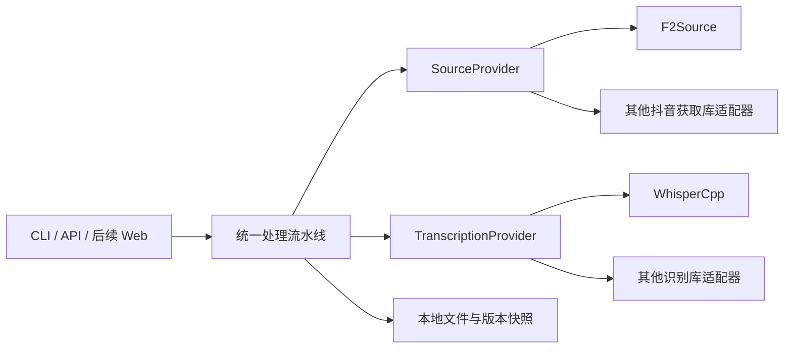

# 可替换的视频来源与语音转写模块

服务端位于 `backend/src/douyin2text/`。`pipeline.py` 编排下载、音轨提取、转写和归档，第三方库通过 `providers/` 中的适配器接入。当前内置 F2 和 whisper.cpp；替换库需要新增适配器并修改配置，不需要改 CLI、API 路由、文件保存或处理流水线。

## 模块边界



`contracts.py` 定义标准数据和接口。平台字段解析位于 F2 适配器，whisper.cpp HTTP 协议与响应转换位于 WhisperCpp 适配器。共用下载器仍执行平台域名、公网地址和文件大小校验；替换获取库不会自动放宽这些约束。

## 视频来源接口

实现 `SourceProvider` 的四项约定：

| 成员 | 约定 |
| --- | --- |
| `name` | 在结果 manifest 中记录的获取引擎名称 |
| `headers()` | 返回媒体请求使用的请求头，不在日志中输出凭据 |
| `resolve_id(url)` | 异步返回平台视频 ID；当前服务限抖音单视频，ID 必须是数字 |
| `describe(media_id, max_short_edge)` | 异步返回 `SourceMedia`，包含标题、作者、时间、视频与封面候选地址、选择信息和原始元数据 |

`SourceMedia` 的字段见 [接口定义](../backend/src/douyin2text/providers/contracts.py)。适配器将上游返回值转换成这份数据，不把库专属字段交给流水线。需要登录时抛出 `LoginRequired`，需要人工确认时抛出 `ConfirmationRequired`，由网关转换成相应任务状态。

当前内置适配器为 [F2Source](../backend/src/douyin2text/providers/f2.py)。F2 使用延迟导入，切换到其他来源适配器后可不安装 F2。

## 语音转写接口

实现 `TranscriptionProvider`：

| 成员 | 约定 |
| --- | --- |
| `name` | 识别引擎名称，写入 manifest 和 Markdown |
| `parameters` | 可序列化的识别参数，不包含密钥 |
| `ready()` | 异步返回引擎是否可用，供网关健康检查使用 |
| `transcribe(audio)` | 接收本地 16 kHz 单声道 WAV 路径，异步返回 `Transcript` |

`Transcript` 保存完整文字、语种代码、带起止秒数的片段，以及可选原始引擎响应。时间范围必须有效，文字、语种及片段不能为空。提供方负责识别，流水线继续执行媒体时长覆盖与重复片段检查。

当前内置 [WhisperCpp](../backend/src/douyin2text/providers/whisper_cpp.py) 通过回环地址请求 whisper-server，并把 `english` 和 `chinese` 标准化为 `en` 和 `zh`。替代适配器也应使用语种代码。客户端接受非空引擎名称，继续校验模型 SHA-256、来源、媒体路径及 Markdown 完整性。

## 配置切换

原有配置不带 `providers` 时默认使用 F2 和 whisper.cpp，并保留原缓存指纹。新配置可以明确指定：

```json
{
  "providers": {
    "source": {"name": "f2"},
    "asr": {
      "name": "whisper_cpp",
      "options": {"base_url": "http://127.0.0.1:8767"}
    }
  }
}
```

新增适配器的构造函数接收一个 `options` 字典。安装该适配器的 Python 包后，可以使用可信配置中的 `module:factory` 路径加载：

```json
{
  "providers": {
    "source": {
      "name": "another-douyin-library",
      "factory": "my_adapters.source:AlternativeSource",
      "options": {}
    },
    "asr": {
      "name": "another-local-asr",
      "factory": "my_adapters.asr:AlternativeASR",
      "options": {}
    }
  }
}
```

示例中的替代包需要自行实现、安装；仓库没有伪造这些库的实际接入。工厂也可以注册在 `SOURCE_FACTORIES` 或 `ASR_FACTORIES` 中。配置由服务管理员控制，HTTP 请求不能指定 Python 工厂；未知提供方会明确失败，不自动切换引擎。

切换 `providers` 名称、工厂或参数会改变有效转写和输出指纹，避免复用旧引擎的任务及转写缓存。更换模型、推理参数或翻译版本时，也需更新原配置的 `asr_fingerprint` 或 `output_fingerprint`。模型名称、来源、SHA-256 和模型文件路径仍由服务配置提供；网关健康检查目前仍要求本地模型文件存在。

## 安装与目录迁移

原 `server-v1-draft/` 的服务端文件迁入 Python 包，旧模块改为以下入口：

| 原文件 | 新文件 |
| --- | --- |
| `api_v1.py` | `backend/src/douyin2text/api.py` |
| `pipeline_v1.py` | `backend/src/douyin2text/pipeline.py` |
| `markdown_v1.py` | `backend/src/douyin2text/markdown.py` |
| `artifacts.py` 与 `safe_network.py` | `backend/src/douyin2text/` 中的同名模块 |
| `test_api_v1.py` | `backend/tests/integration/test_gateway.py` |

在仓库根目录创建独立环境并安装基础包；使用 F2 时额外安装该依赖，版本参考原交接材料：

```sh
python3 -m venv .venv
.venv/bin/python -m pip install -e backend
.venv/bin/python -m pip install 'f2 @ git+https://github.com/Johnserf-Seed/f2.git@3f842b6b28bf70e5525631f7d992245b2dbccc0b'
```

`backend/pyproject.toml` 提供可安装包和运行依赖范围，尚未锁定完整生产依赖。现有 Node 客户端继续位于 `integration-bundle/`，`handoff/` 保留为历史交接快照。

准备配置、令牌、模型和数据目录后，用新入口启动：

```sh
export DOUYIN2TEXT_DATA_DIR='/absolute/local/media-data'
export DOUYIN2TEXT_CONFIG='/absolute/private/config.json'
.venv/bin/python -m douyin2text.api
```

参考 [配置模板](../backend/config.example.json)，替换模型及指纹占位值。在数据根目录预先创建 `state/`、`models/`、`video/`、`audio/`、`transcripts/`、`metadata/`、`tmp/`，将私有令牌写入 `state/api-token` 并设为 0600。whisper-server 和 FFmpeg 仍需单独安装；当前媒体工具路径沿用 `/opt/homebrew/bin/`。迁移已有 launchd 配置时需更新 Python、启动模块、工作目录和环境变量。

默认数据目录仍兼容旧部署；不会自动迁移或修改旧资料。开启已有英文翻译脚本时，在 `translation` 配置中指定 `python` 和 `script` 的绝对路径，并提供已有模型、哈希等参数。翻译脚本应兼容标准化转写及语种代码；该脚本未收录，无法在本次验证其运行。

## 验证范围

```sh
.venv/bin/python -m unittest discover -s backend/tests -v
cd integration-bundle
npm test
```

后端测试覆盖 F2 元数据标准化、whisper.cpp HTTP 协议、配置切换、错误结果，以及替代提供方通过流水线、文件快照和 API 的完整链路。测试使用临时文件与合成适配器，不读取生产令牌，不请求真实抖音或实际模型。现有依赖真实媒体的网关测试另放在 `backend/tests/integration/`，需要准备部署后设置 `DOUYIN2TEXT_RUN_DEPLOYMENT_TESTS=1` 单独执行。

Web 管理、汇总和完整翻译仍属于后续模块。本次重构建立可替换的获取与转写边界，没有把未实现的产品能力标为已完成。
